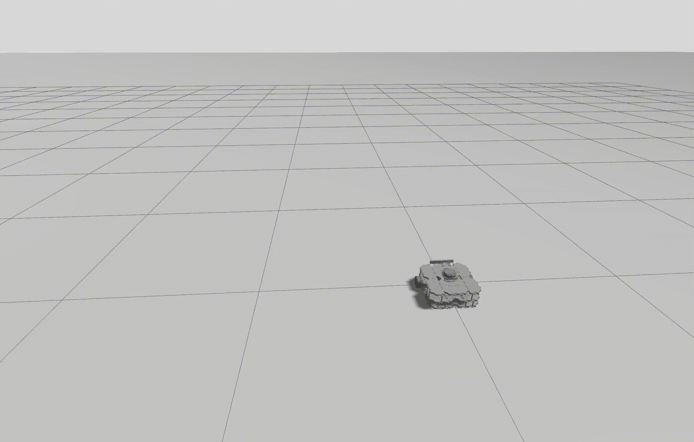

# DFL-QP Unicycle Controller

## 🎥 Gazebo Simulation Results


This repository provides the **ROS 2 Jazzy implementation** of the controller proposed in the paper:

> **Hamza Tariq**, Usman Ali, and Adeel Akhtar  
> **“Simultaneous Tracking and Stabilization of a Non-holonomic Robot: A Lipschitz-Continuous Quadratic-Program-Based Controller”**, 2025.  

The **DFL-QP (Unicycle)** controller unifies trajectory tracking and point stabilization for differential-drive robots through a **time-invariant, Lipschitz-continuous quadratic program**.  
It ensures controller feasibility even at zero velocity, overcoming the singularities of standard DFL.

---

Below are the simulation results demonstrating **point stabilization** and **trajectory tracking** for the proposed **DFL-QP controller**, compared against the **standard DFL controller**.

---

### 🟢 Point Stabilization


---

### 🔵 Trajectory Tracking Comparison

<table>
<tr>
<td align="center"><b>Proposed DFL-QP Controller</b></td>
<td align="center"><b>Standard DFL Controller</b></td>
</tr>
<tr>
<td></td>
<td></td>
</tr>
</table>


---

## 🧠 Key Features
- Unified control for **tracking + point stabilization**
- **QP-based**, Lipschitz-continuous formulation
- Implemented in **ROS 2 Jazzy + Gazebo Harmonic**
- Includes **standard DFL** controller for comparison
- Verified on **Ubuntu 24.04 LTS**

---

## 🧩 Environment Setup

| Component | Recommended Version |
|------------|--------------------|
| **Ubuntu** | 24.04 LTS |
| **ROS 2** | Jazzy Jalisco |
| **Python** | 3.10 – 3.12 |
| **CMake** | ≥ 3.16 |
| **Gazebo** | Harmonic |

---

## 🧰 Python and ROS Dependencies
```bash
# System and ROS dependencies
sudo apt update
sudo apt install python3-pip python3-numpy python3-scipy \
                 ros-jazzy-rclpy ros-jazzy-geometry-msgs \
                 ros-jazzy-std-msgs ros-jazzy-nav-msgs \
                 ros-jazzy-tf-transformations

# Python optimization and math libraries
pip install qpsolvers osqp scipy numpy
```


## Run the experiments
```bash
git clone https://github.com/gradslab/DFL_QP_Unicycle.git
cd DFL_QP_Unicycle/
colcon build
```
Now in a new terminal 
```bash
source path_to_cloned_repo/DF_QP_Unicycle/install/setup.bash
```

Spawn the robot for point stabilization experiment
```bash
ros2 launch my_robot_bringup my_robot_gazebo.launch.xml x:=1.0 y:=0.0 yaw:=1.57079632679
```

Then in a new terminal source the workspace again run the command
```bash
ros2 run controllers fblqp_controller 0.0 0.0 1.57079632679
```

To run trajtory tracking experiment
```bash
ros2 launch my_robot_bringup my_robot_gazebo.launch.xml x:=-0.25 y:=0.0 yaw:=3.14159
```

Then in a new terminal source the workspace again run the command
```bash
ros2 run controllers fblqp_controller 0.0 0.0 1.57079632679
```
Alternatively, if you want to run tracking for tradition DFL method run 
```bash
ros2 run controllers std_dfl_tracking
```